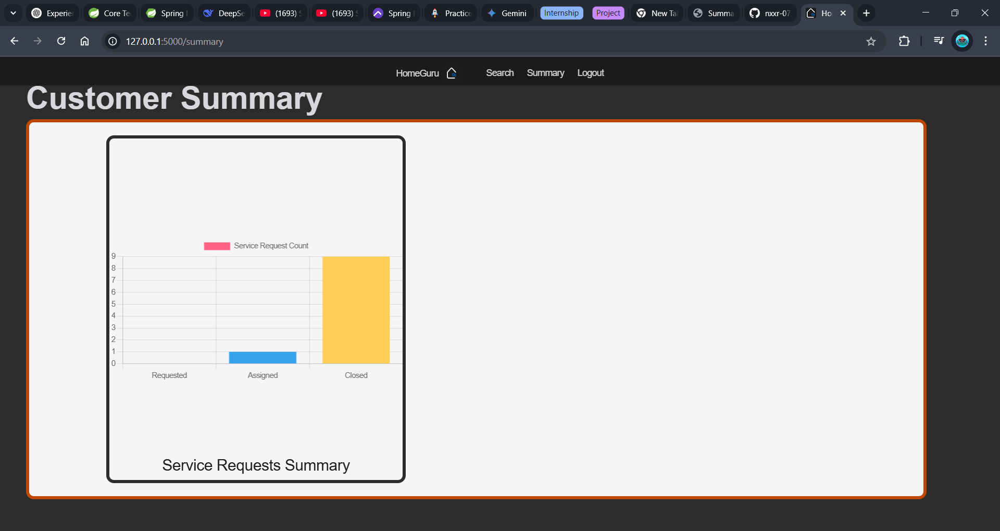

# HomeGuru

HomeGuru is a Home Services Web Application built using Python Flask and SQLite3. It allows customers to book home services, professionals to manage their service requests, and admins to oversee the platform.

## Features

- **User Authentication:** Separate sign-up and login for customers and professionals.
- **Service Booking:** Customers can browse and book services by type.
- **Professional Dashboard:** Professionals can view, accept, and manage service requests.
- **Admin Panel:** Admins can manage users, approve professional requests, and add/edit/delete services.
- **Search Functionality:** Search for services, professionals, and customers.
- **Service History & Reviews:** Customers can view their service history and submit reviews.
- **Responsive UI:** Clean, modern interface with dashboards for each user type.

## Project Structure

```
.
├── main.py
├── requirements.txt
├── Website/
│   ├── __init__.py
│   ├── models.py
│   ├── views.py
│   ├── auth.py
│   ├── admin_routes.py
│   ├── Static/
│   └── templates/
├── assests/
│   ├── adm_summary.png
│   ├── admin_dash.png
│   ├── professional_summary.png
│   ├── request_service.png
│   ├── search.png
│   ├── service_provider_dash.png
│   ├── user_dash.png
│   └── user_summary.png
└── instance/
    └── database.db
```

## Setup Instructions

1. **Clone the repository:**
   ```sh
   git clone <your-repo-url>
   cd HomeGuru
   ```

2. **Create a virtual environment and activate it:**
   ```sh
   python -m venv venv
   source venv/bin/activate  # On Windows: venv\Scripts\activate
   ```

3. **Install dependencies:**
   ```sh
   pip install -r requirements.txt
   ```

4. **Run the application:**
   ```sh
   python main.py
   ```

5. **Access the app:**
   Open your browser and go to `http://127.0.0.1:5000/`

## Screenshots

### User Dashboard


### User Service Summary


### Professional Dashboard


### Professional Service Summary


### Admin Dashboard


### Admin Service Summary


### Service Request Page


### Search Functionality


---

## License

This project is for educational purposes.
